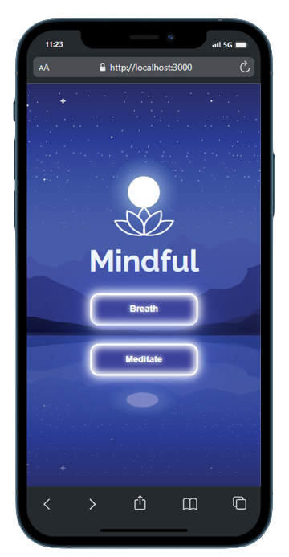
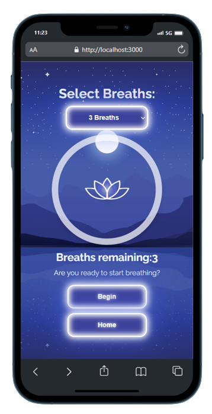
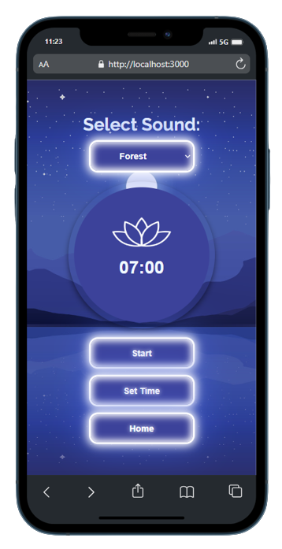

# Mindful

Mindful is a meditation app designed to help users find tranquility and mindfulness. It features a timer with soothing sound effects for meditation and guided breathing exercises to help users relax and find inner peace.

## Technologies Used

- 
- 

## Live Demo

Check out the live demo of Mindful at: [Mindful Live Demo](https://react-mindful.vercel.app/)

## Installation

To run Mindful on your local machine, follow these steps:

1. Clone the repository using:
   ```bash
   git clone https://github.com/TonyLig/React-Mindful.git
   ```
2. Install the required dependencies with:

   ```bash
   npm install
   ```

3. Start the application with:

   ```bash
   npm start
   ```

## Screenshots

Here are some screenshots of the Mindful app:






